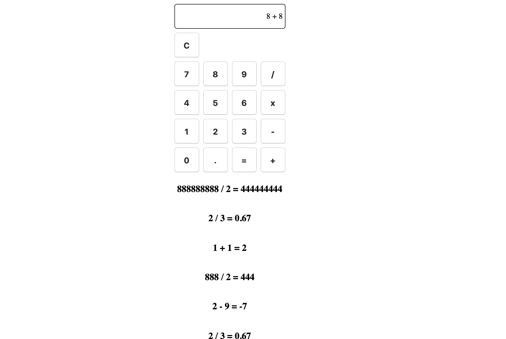

# Calculator

A simple full-stack calculator app using react, node and postgreSQL. Displays the most 10 most recent expressions below the calculator.

[Try it](https://frozen-peak-21569.herokuapp.com/)

## Built With

- HTML
- CSS
- JavaScript
- Axios
- Express
- Nodemon
- Pg
- React/Redux/Saga

## Getting Started

These instructions will get you a copy of the project up and running on your local machine for development and testing purposes. See deployment for notes on how to deploy the project on a live system.

### Prerequisites

- [Node.js](https://nodejs.org/en/)
- [Postico](https://eggerapps.at/postico/)
- [Postman](https://www.getpostman.com/)
- [IDE - Virtual Studio Code Recommended](https://code.visualstudio.com/)
- [Heroku - Create Account](https://www.heroku.com/)

### Installing

1. Download this project via zip
2. Create a repository on github for this project
3. Open downloaded zip of project in your IDE
4. Follow the instructions outlined on Github for ... or create a new repository on the command line (these immediately follow the creation of a new repository)
5. Create database in Postico with database name of 'calculator'
6. Insert sql-text from database.sql file located in server root into database sql-query in Postico
7. Execute sql queries to create tables
8. In terminal, start postgres server (this will start calculator database)
9. In terminal, create development server by typing `npm run client` and `npm run server` (this will run application locally)

### Deploying
1. Install Heroku CLI by typing `brew install heroku` in Terminal
2. Authenticate by typing `heroku login` in Terminal
3. In terminal, navigate to your project folder and type `heroku create`
4. In terminal, type `git remote -v` to ensure it added successfully
5. In terminal, type `git push heroku master`
6. In terminal, type `heroku addons:create heroku-postgresql:hobby-dev` to set up Postgresql on your Heroku project
7. In terminal, type `heroku pg:push calculator DATABASE_URL` to copy your database contents up to Heroku. 
8. If changes are made within the IDE and you want them reflected on Heroku following the following prompts:
  - `git add .`
  - `it commit -m "MESSAGE"`
  - `git push heroku master`
